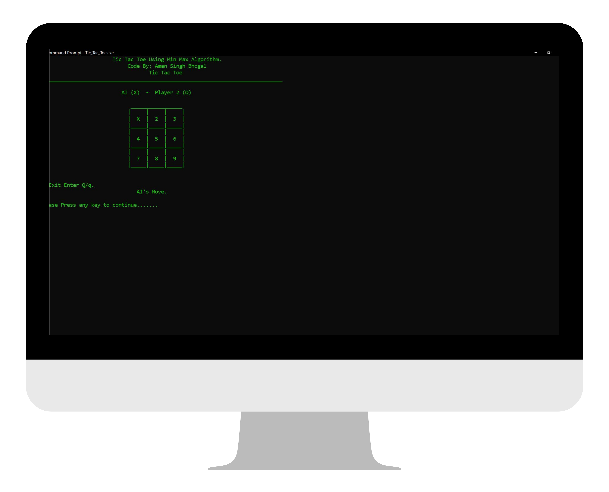
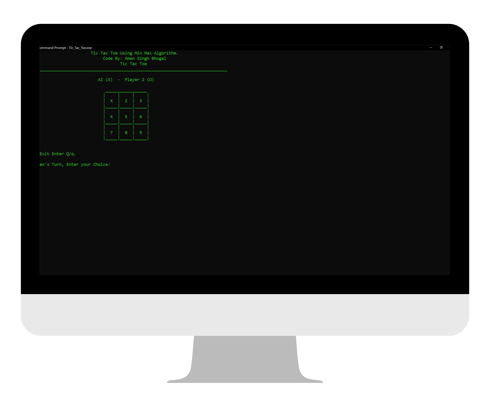
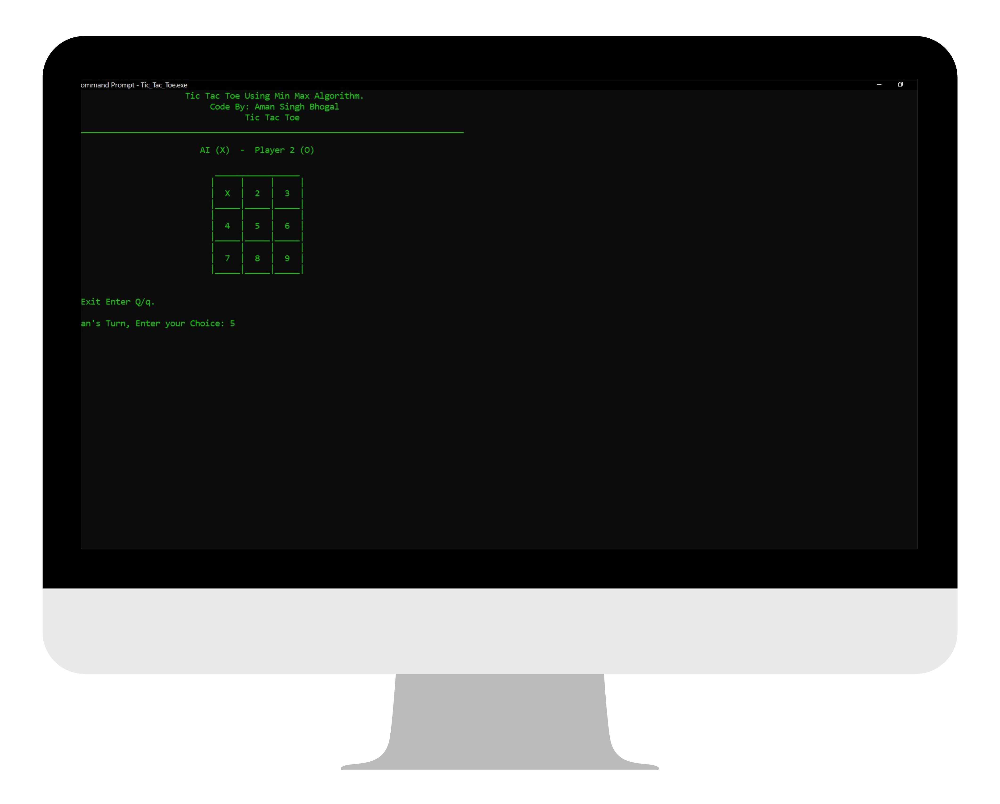
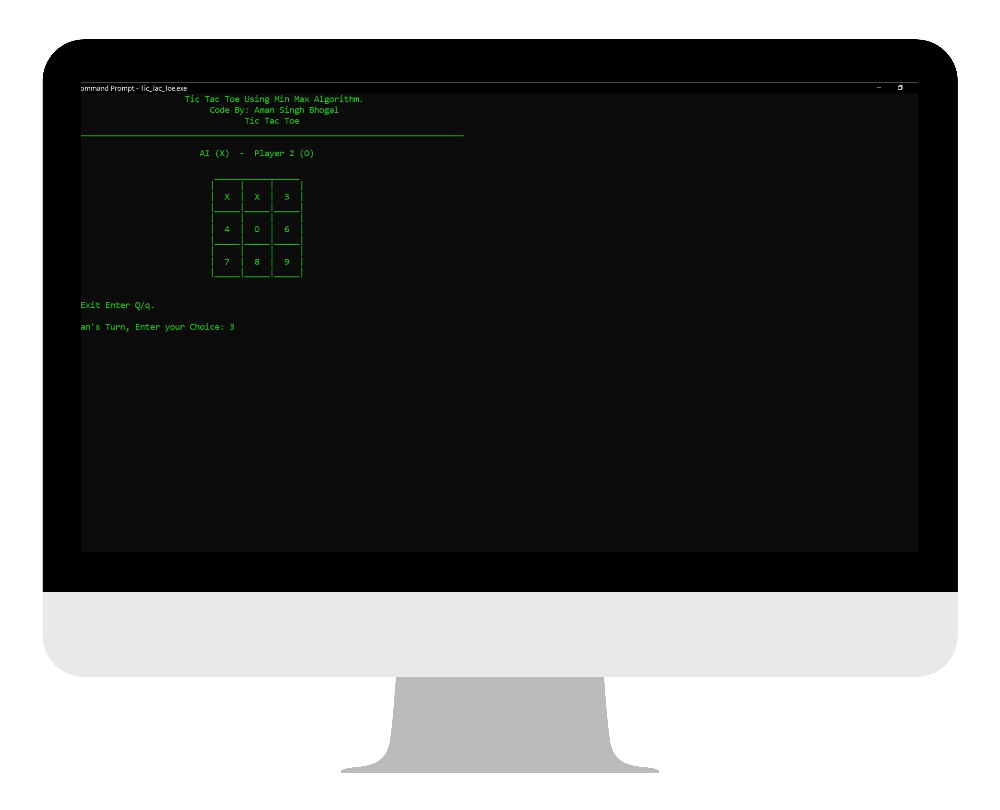
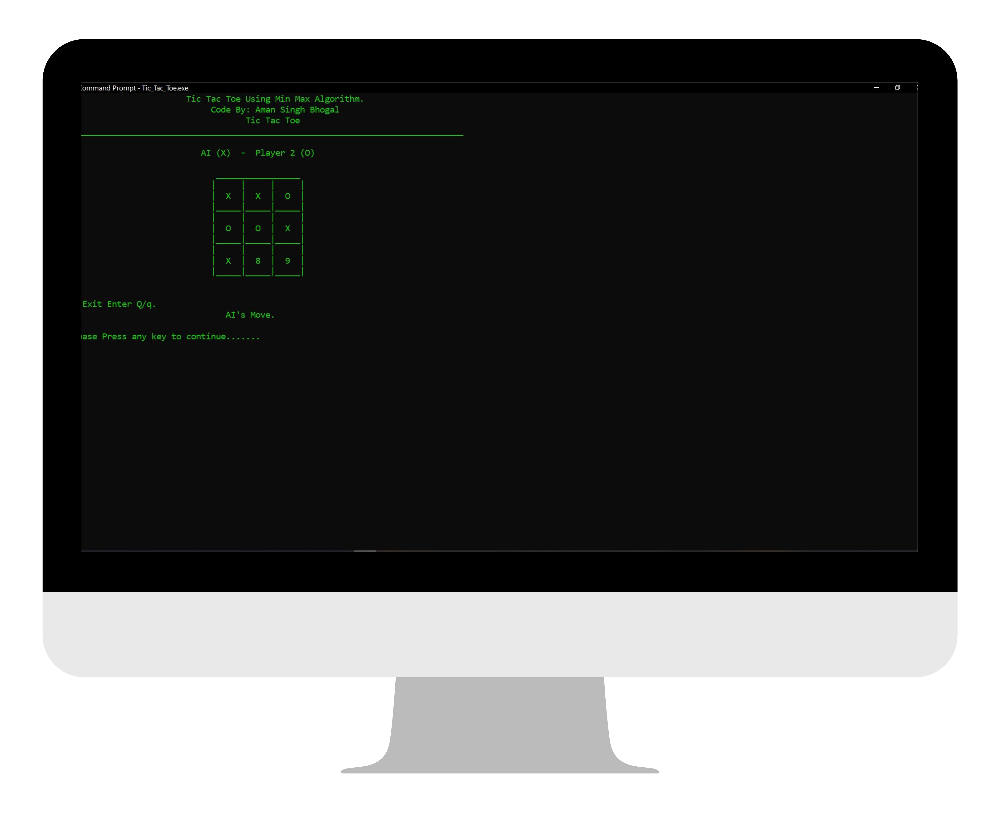
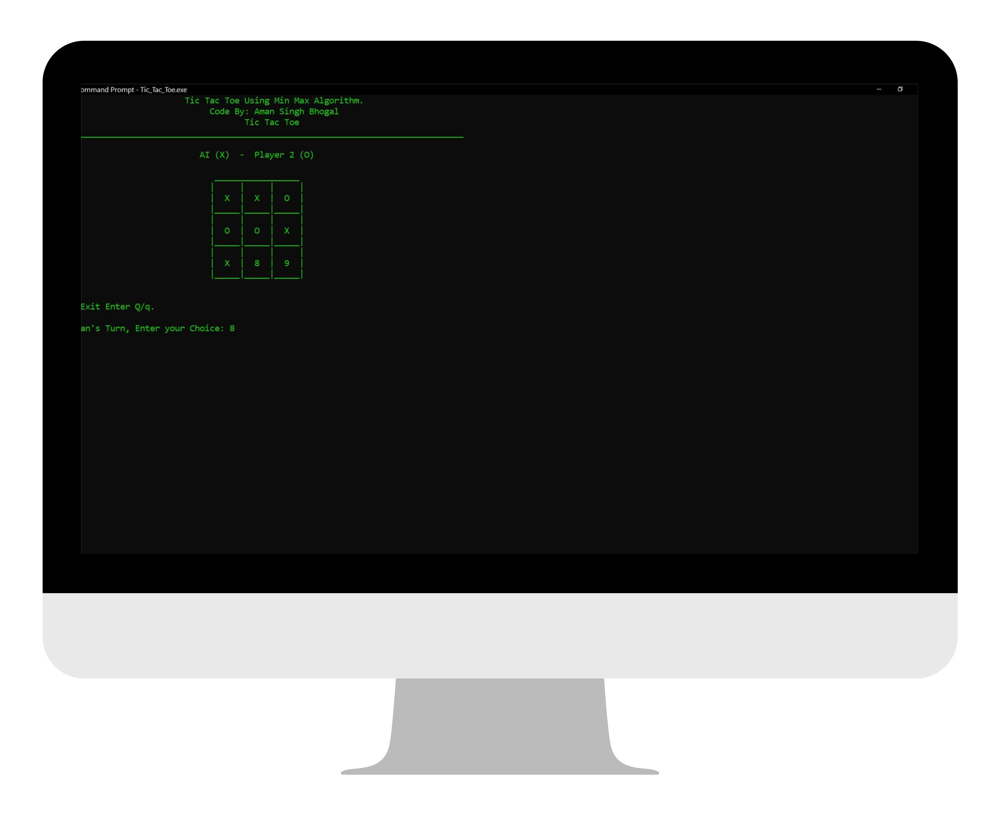
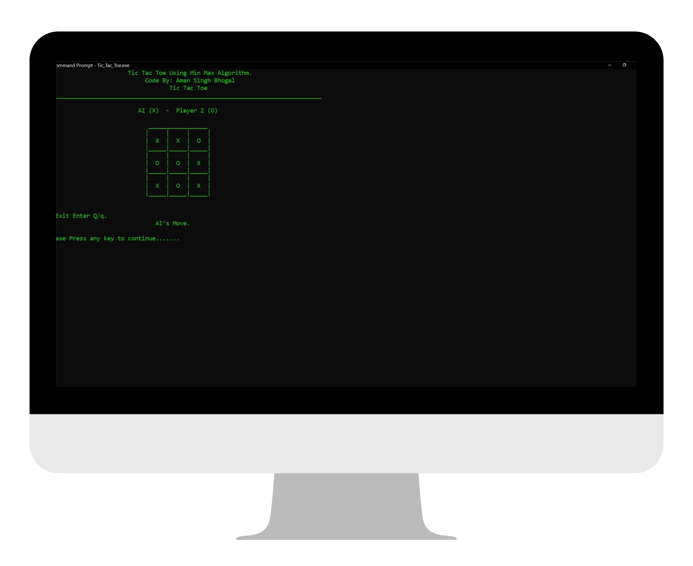

<div align="center">
  
  <h1 align="center">Tic Tac Toe</h1>
</div>

<h2>Check it our at: https://www.onlinegdb.com/TTk0kSCqO</h2>

## About Tic Tac Toe:
Tic-tac-toe is a game in which two players take turns in drawing either an ' O' or an ' X' in one square of a grid consisting of nine squares. The winner is the first player to get three squares of the same symbols in a row, column or diagonal. This C++ Code uses the MiniMax Algorithm to play as computer opponent.

## Screen Shots:
<div align="center">
  
  
  
  
  
  
  
  
  
  
  
</div>

### Steps to Run on Local Machine

***

#### Note: You need to have C++ compiler installed in your local Machine for Successfully running the code. <a href="https://sourceforge.net/projects/mingw/">Install MinGW </a>
##### Step 1) Clone AmanSinghBhogal/Tic-Tac-Toe.
##### Step 2) Open Tic-Tac-Toe cloned Directory in Command Prompt and run the following command:
```
g++ Tic_Tac_Toe.cpp -o Tic_Tac_Toe
```
#### Step 3) Next, Run the following Command (it will execute the previously compiled file):
```
Tic_Tac_Toe.exe
```

***

<h1 align="center">Thank You</h1>

***